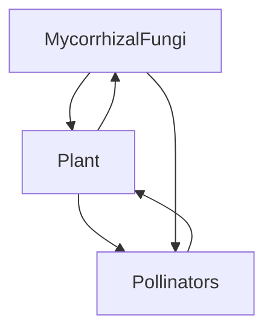
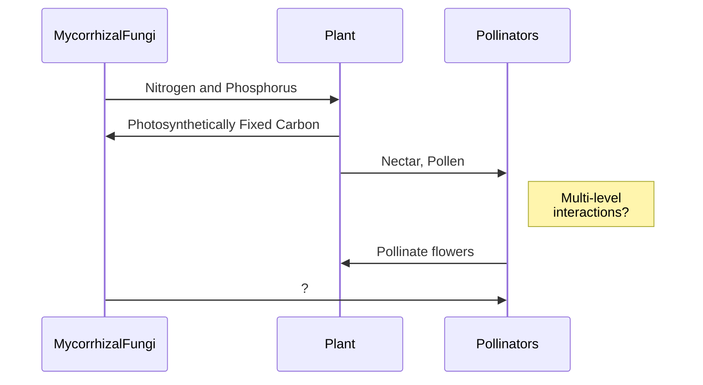

# Header

## Smaller Header

### Small Header

#### Smaller than last Header

##### Almost smallest Header

###### Smallest Header


## Unordered lists

* hi
* this is laney
* I am typing this unordered list
	+ sub-item 
	+ second sub-item

## Ordered Lists

1. Hello
2. This is an ordered list
3. This is the third item on the ordered list


```
This is a plain code block. I used fencing to create this.

```

```{r}
This is an R code block. What is written here will show up just as code does in R. 
x <- 3
y <- "character string"

```

Manual line
break.
I am writing a sentence and
including manual line breaks.

## Image
Image: 

## Block quotes
Block quotes with '>'

> Block quote goes here. This is how you do it.

## Horizontal Line

****


## Highlight

==I am highlighting this line.== I put two equals signs in the front and back of the ==sentence.== 


## Link

[link](www.rstudio.com)

## In line equation

$a = 3 + 4$ will appear inside a line of text.


##  Centered Equation

To center an equation, $$ is used to block the equation in Typora.
$$
a = 2 + 3
$$


## Simple Table

Table Header  | Next Header
---------------------|---------------------
Table cell          | Table cell
Other cell         | Other cell







